# 小程序完整用户旅程

**场景**：一个舞蹈爱好者打开小程序 → 找到感兴趣的舞室 → 查看课表 → 约课成功

## 一句话结论

数据在**后端 MySQL（经 Prisma）**里，由 `crawler` 从 iWOD / 菲体云抓取导入；小程序运行时**不直连 iWOD 接口**，只调自己的 Express API（`/api/*`），课表列表有 **Redis 缓存（300s）**，前端用 `globalData` + 页面内存缓存辅助。

---

## 流程图

```mermaid
flowchart TD
    A["用户打开小程序<br/>app.js onLaunch → init()"]:::entry
    A --> B["POST /api/auth/login<br/>(wx.login 拿 code + 本地 devDeviceId)"]:::auth
    B --> C["GET /api/cities → globalData.cities<br/>GET /api/config/subscribe → 提醒模板ID"]:::auth
    C --> D["进入「发现」tab<br/>pages/discover/discover"]:::page

    D --> D1["GET /api/studios?cityId=&keyword=<br/>GET /api/follows"]:::api
    D1 --> D2["A-Z 索引条浏览舞室列表<br/>(来源: MySQL studio 表)"]:::data
    D2 --> D3{"感兴趣?"}:::branch
    D3 -->|关注| D4["POST /api/follows {studioId}"]:::api
    D3 -->|点进舞室| E["pages/studio/weekly?id="]:::page

    D4 --> E
    E --> E1["GET /api/studios/:id<br/>GET /api/schedules?studioId=&from=&to=<br/>(一周 7 天, 前端 weeksCache 内存缓存)"]:::api
    E1 --> E2["来源: MySQL schedule + coach 表"]:::data
    E2 --> F["选某节课 → pages/course/detail?id="]:::page

    F --> F1["GET /api/schedules/:id<br/>(bookingStatus / bookedCount / capacity)<br/>GET /api/schedules/:id/video-preview<br/>(来源: YouTube Data API, 仅海外平台)"]:::api
    F1 --> F2{"点「预约」"}:::branch

    F2 --> G["POST /api/bookings<br/>{scheduleId, method: JUMP}"]:::api
    G --> G1["booking 落库 status=PENDING<br/>(来源: MySQL booking 表)"]:::data
    G1 --> H["跳转官方约课小程序<br/>jump.jumpToPlatform"]:::page
    H --> H1{"舞室平台?"}:::branch
    H1 -->|iWOD 系有 bookingMiniAppId| H2["wx.navigateToMiniProgram<br/>跳官方小程序"]:::page
    H1 -->|菲体云/其他无 appId| H3["复制舞室名 → 引导微信搜索"]:::page

    H2 --> I["用户在官方小程序完成约课<br/>返回本小程序"]:::page
    H3 --> I
    I --> J["点「我已约好」<br/>PUT /api/bookings/:scheduleId/confirm"]:::api
    J --> K["booking status → CONFIRMED<br/>✅ 约课成功"]:::success

    D4 -.->|"首页「课表」tab pages/index/index<br/>GET /api/timeline?cityId=&date=<br/>聚合已关注舞室当日课程<br/>(Redis 缓存 timeline:* TTL300s)"| ALT["「课表」tab 是另一入口<br/>只显示已关注舞室"]:::page

    classDef entry fill:#1a1a2e,color:#00F5D4,stroke:#00F5D4;
    classDef page fill:#1a1a2e,color:#fff,stroke:#555;
    classDef api fill:#0f3460,color:#9be7ff,stroke:#00F5D4;
    classDef data fill:#222,color:#aaa,stroke:#444;
    classDef branch fill:#1a1a2e,color:#ffd166,stroke:#ffd166;
    classDef success fill:#0b3d2e,color:#00F5D4,stroke:#00F5D4;
    classDef auth fill:#2d1b4e,color:#c8a0ff,stroke:#c8a0ff;
```

---

## 逐步说明（页面 → 接口 → 数据来源）

| # | 步骤 | 页面（app.json） | 调用的接口 | 数据从哪来 |
|---|------|------------------|-----------|-----------|
| 1 | 启动登录 | 全局 `app.js` | `POST /api/auth/login` | 微信 `wx.login` 的 code + 本地 `devDeviceId`（storage 持久化） |
| 2 | 拉城市/配置 | 全局 `app.js` | `GET /api/cities`、`GET /api/config/subscribe` | MySQL `city` 表；订阅模板 ID 来自配置 |
| 3 | 找舞室 | `pages/discover/discover` | `GET /api/studios`、`GET /api/follows` | MySQL `studio` 表（crawler 从 iWOD/菲体云导入，非实时接口） |
| 4 | 关注 | `pages/discover/discover` | `POST /api/follows` | 写 MySQL `follow` 表 |
| 5 | 舞室周课表 | `pages/studio/weekly` | `GET /api/studios/:id`、`GET /api/schedules` | MySQL `schedule`+`coach`；前端 `weeksCache` 内存缓存一周 |
| 6 | 课程详情 | `pages/course/detail` | `GET /api/schedules/:id`、`/video-preview` | MySQL；视频预告来自 **YouTube Data API v3**（仅海外平台） |
| 7 | 发起约课 | 详情页/课表面板 | `POST /api/bookings`（method=JUMP） | 写 MySQL `booking`，status 先置 `PENDING` |
| 8 | 跳转官方 | `services/jump.js` | 无（本地跳转） | `studio.bookingMiniAppId`（iWOD 系有）→ `wx.navigateToMiniProgram`；否则复制店名引导搜索 |
| 9 | 确认成功 | 详情页/课表面板 | `PUT /api/bookings/:scheduleId/confirm` | 更新 `booking` → `CONFIRMED` |
| 10 | （可选）首页课表 | `pages/index/index` | `GET /api/timeline`、`/bookings/pending-count` | Redis 缓存 `timeline:{cityId}:{date}`（TTL 300s），miss 查 MySQL，只返回已关注舞室 |

---

## 关键结论：数据来源三问

1. **iWOD 是接口吗？** 不是。`iWOD-studios.jsonl` 是爬虫抓下来的**店铺样本数据**；`crawler`（[server/src/crawler](server/src/crawler)）把它连同课表批量导入 MySQL，小程序运行时读的是**自己的数据库**，不实时打 iWOD。

2. **有本地缓存吗？** 有，三层：
   - 前端：`globalData`（cities/cityId/token）+ `weeksCache`（页面内存）+ `wx.setStorageSync`（devDeviceId）。
   - 后端：Redis 缓存 `timeline:*`（TTL 300s，写入/抓取后 `invalidateTimelineCache` 清掉）。

3. **外部数据**：仅课程预告视频调了 **YouTube Data API v3**，且只在 `INSTAGRAM/YOUTUBE/NAVER` 等海外平台展示。
