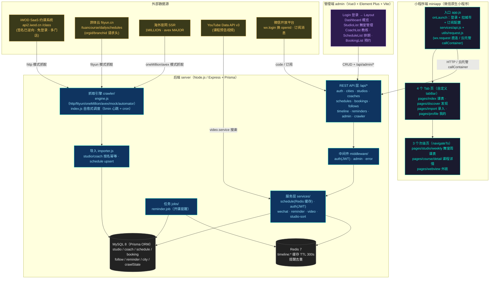
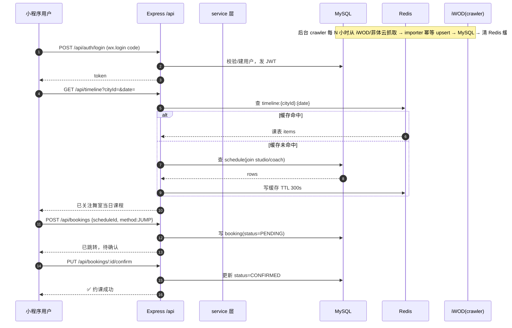

# DanceHub 系统架构图

## 整体架构（graph TD）

---

## 四个部分的定位

### 1. 小程序端（7 个页面，两类）

| 分类 | 页面 | 作用 |
|------|------|------|
| **Tab 页 ×4** | `pages/index/index` 课表 | 聚合「已关注」舞室的当日课程（GET `/api/timeline`） |
| | `pages/discover/discover` 发现 | A-Z 索引条浏览/搜索舞室、关注（GET `/api/studios` + `/follows`） |
| | `pages/import/import` 录入 | 目前是**占位壳**（JS 仅设置 region 与 tabBar 选中态） |
| | `pages/profile/profile` 我的 | 我的关注 / 预约记录 / 开课提醒管理 |
| **次级页 ×3** | `pages/studio/weekly` | 单个舞室一周 7 天课表（GET `/api/schedules`） |
| | `pages/course/detail` | 单节课详情 + 约课 + 视频预告 |
| | `pages/webview` | 外链网页（课程视频等） |

### 2. 后端（server/）

- **技术栈**：Node.js + Express 4 + Prisma 5（MySQL 8）+ ioredis（Redis 7）+ JWT + node-cron + pinyin-pro（舞室按拼音排序）。
- **模块分层**：`routes/`（13 组 REST 路由）→ `middleware/`（JWT 鉴权 / admin 校验 / 错误处理）→ `services/`（业务逻辑）→ `lib/prisma.js` + `lib/redis.js`（数据访问）。
- **两个常驻调度**：`crawler/`（抓取编排，自愈式 5 分钟心跳 + 可选 cron，状态落 `CrawlState` 表）和 `jobs/reminder.job.js`（开课提醒）。
- **两种运行模式**：本地常驻（`scheduler`）或云托管定时触发器（`trigger`，`POST /api/crawler/tick` 驱动）。

### 3. 外部数据源（iWOD 数据怎么进来）

- **iWOD 是反向工程的 SaaS 接口**（[engine.js](server/src/crawler/engine.js) `crawlWithHttp`）：直接调 `api2.iwod.cn/class`，免登录、签名算法已从小程序逆向复现（`iwodSignature`），`isAllBoxClasses=1` 一次带出品牌全部门店。
- **同类平台并列**：菲体云（fityun，orgid/branchid 请求头）、1MILLION / avex MAJOR（官网 SSR 抓 JSON）。
- **入库链路**：`crawl()` 抓原始卡片 → `mapRawToSchedule` 映射 → `importSchedules`（studio/coach 按名幂等、schedule 按「studio+日期+课名+时间」upsert）→ 写 MySQL → `invalidateTimelineCache()` 清 Redis。
- **兜底模式**：`automator`（miniprogram-automator 开微信开发者工具抽 DOM）、`mock`（演示数据）。

### 4. 管理端（admin/）

- **给谁用**：**运营/管理员**（内部后台，`/api/admin/check` 鉴权，非 C 端用户）。
- **管什么**：舞室（StudioList）、教练（CoachList）、课程排期（ScheduleList，含「复制上周排期」）、预约记录（BookingList）、数据概览（Dashboard）——即对 MySQL 里 crawler 抓进来的数据做**增删改查与纠偏**。

---

## 核心数据流（sequenceDiagram：读课表 + 约课）

---

## 关键结论

1. **数据永远是「抓取 → MySQL → API → 小程序」**，小程序运行时**不直连 iWOD**，iWOD 只是 crawler 的抓取源之一（另有菲体云、1MILLION、avex）。
2. **Redis 只做两件事**：`timeline:*` 课表缓存（TTL 300s，抓取/改排期后主动失效）+ 开课提醒去重。
3. **三方权限边界**：小程序走 `requireAuth`（JWT，微信登录）；管理端额外走 `requireAdmin`；舞室/课表的**写**操作只在 admin 端。
